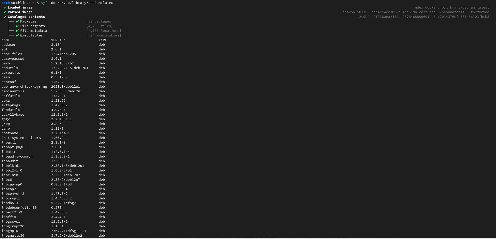

# Task 3

## A)

Referring the `syft` documentaion, after installing the syft tool, below command is used to analyze the image. 

```cli
syft docker.io/library/debian:latest
```

Below image shows the analysis of the `docker.io/library/debian:latest` using `syft` tool. 



Full output generated from `syft` tool. 

```cli
arch@archlinux ~ % syft docker.io/library/debian:latest
 ✔ Loaded image                                                                                                                                                                                        index.docker.io/library/debian:latest
 ✔ Parsed image                                                                                                                                                      sha256:5027089adc4ce4ec3058d84ce51db1cd2f3eac5675e5aadfcf1f585f62fec9ed
 ✔ Cataloged contents                                                                                                                                                       12c9b4c49f336aea2444dc28764c88096914c6ec7e14376efc53140c103fbcb3
   ├── ✔ Packages                        [88 packages]  
   ├── ✔ File digests                    [4,733 files]  
   ├── ✔ File metadata                   [4,733 locations]  
   └── ✔ Executables                     [694 executables]  
NAME                    VERSION                TYPE   
adduser                 3.134                  deb     
apt                     2.6.1                  deb     
base-files              12.4+deb12u5           deb     
base-passwd             3.6.1                  deb     
bash                    5.2.15-2+b2            deb     
bsdutils                1:2.38.1-5+deb12u1     deb     
coreutils               9.1-1                  deb     
dash                    0.5.12-2               deb     
debconf                 1.5.82                 deb     
debian-archive-keyring  2023.3+deb12u1         deb     
debianutils             5.7-0.5~deb12u1        deb     
diffutils               1:3.8-4                deb     
dpkg                    1.21.22                deb     
e2fsprogs               1.47.0-2               deb     
findutils               4.9.0-4                deb     
gcc-12-base             12.2.0-14              deb     
gpgv                    2.2.40-1.1             deb     
grep                    3.8-5                  deb     
gzip                    1.12-1                 deb     
hostname                3.23+nmu1              deb     
init-system-helpers     1.65.2                 deb     
libacl1                 2.3.1-3                deb     
libapt-pkg6.0           2.6.1                  deb     
libattr1                1:2.5.1-4              deb     
libaudit-common         1:3.0.9-1              deb     
libaudit1               1:3.0.9-1              deb     
libblkid1               2.38.1-5+deb12u1       deb     
libbz2-1.0              1.0.8-5+b1             deb     
libc-bin                2.36-9+deb12u7         deb     
libc6                   2.36-9+deb12u7         deb     
libcap-ng0              0.8.3-1+b3             deb     
libcap2                 1:2.66-4               deb     
libcom-err2             1.47.0-2               deb     
libcrypt1               1:4.4.33-2             deb     
libdb5.3                5.3.28+dfsg2-1         deb     
libdebconfclient0       0.270                  deb     
libext2fs2              1.47.0-2               deb     
libffi8                 3.4.4-1                deb     
libgcc-s1               12.2.0-14              deb     
libgcrypt20             1.10.1-3               deb     
libgmp10                2:6.2.1+dfsg1-1.1      deb     
libgnutls30             3.7.9-2+deb12u2        deb     
libgpg-error0           1.46-1                 deb     
libhogweed6             3.8.1-2                deb     
libidn2-0               2.3.3-1+b1             deb     
liblz4-1                1.9.4-1                deb     
liblzma5                5.4.1-0.2              deb     
libmd0                  1.0.4-2                deb     
libmount1               2.38.1-5+deb12u1       deb     
libnettle8              3.8.1-2                deb     
libp11-kit0             0.24.1-2               deb     
libpam-modules          1.5.2-6+deb12u1        deb     
libpam-modules-bin      1.5.2-6+deb12u1        deb     
libpam-runtime          1.5.2-6+deb12u1        deb     
libpam0g                1.5.2-6+deb12u1        deb     
libpcre2-8-0            10.42-1                deb     
libseccomp2             2.5.4-1+b3             deb     
libselinux1             3.4-1+b6               deb     
libsemanage-common      3.4-1                  deb     
libsemanage2            3.4-1+b5               deb     
libsepol2               3.4-2.1                deb     
libsmartcols1           2.38.1-5+deb12u1       deb     
libss2                  1.47.0-2               deb     
libstdc++6              12.2.0-14              deb     
libsystemd0             252.22-1~deb12u1       deb     
libtasn1-6              4.19.0-2               deb     
libtinfo6               6.4-4                  deb     
libudev1                252.22-1~deb12u1       deb     
libunistring2           1.0-2                  deb     
libuuid1                2.38.1-5+deb12u1       deb     
libxxhash0              0.8.1-1                deb     
libzstd1                1.5.4+dfsg2-5          deb     
login                   1:4.13+dfsg1-1+b1      deb     
logsave                 1.47.0-2               deb     
mawk                    1.3.4.20200120-3.1     deb     
mount                   2.38.1-5+deb12u1       deb     
ncurses-base            6.4-4                  deb     
ncurses-bin             6.4-4                  deb     
passwd                  1:4.13+dfsg1-1+b1      deb     
perl-base               5.36.0-7+deb12u1       deb     
sed                     4.9-1                  deb     
sysvinit-utils          3.06-4                 deb     
tar                     1.34+dfsg-1.2+deb12u1  deb     
tzdata                  2024a-0+deb12u1        deb     
usr-is-merged           37~deb12u1             deb     
util-linux              2.38.1-5+deb12u1       deb     
util-linux-extra        2.38.1-5+deb12u1       deb     
zlib1g                  1:1.2.13.dfsg-1        deb   
syft docker.io/library/debian:latest  8.25s user 10.81s system 136% cpu 14.010 total

```

The output seen above demonstrates that Syft was able to locate and classify the software contained in the debian:latest container image. The catalog contains comprehensive details about, package which provides a list of every installed package, along with its version (e.g., dpkg, bash, and apt), file digests which are each file's SHA256 checksum, file metadata including details about each file's metadata and executables which are every file that can be executed inside the container. 

Syft employs a number of methods to determine the program and its iterations inside a container image such as package managers, executable identification and filesystem analysis. Filesystem analysis include information extraction from directories that are known to contain installed software and gathering information and file digests (hashes) to guarantee the accuracy and consistency of the program that is cataloged. Also, Syft searches for frequently occurring executable file locations and types in order to identify executable files. Binaries in directories like /bin, /usr/bin, and /sbin fall under this category.

