# Task 1

## Option B

### Ingress controller

Within a Kubernetes cluster, an Ingress controller is the Kubernetes resource in charge of managing external access to services. By using the rules specified in the Ingress resource, it functions as a reverse proxy to direct traffic to the relevant services. The applications operating within the cluster can be accessed by external users thanks to the Ingress controller's public exposure of HTTP and HTTPS routes. Usually, it manages functions like load balancing, routing according to URL pathways or domain names, and SSL termination.

### Services

Services are an abstraction layer in Kubernetes that specify a logical group of pods and an access policy for them. They make it possible for various pod sets in the cluster to communicate over the network. Services abstract away the dynamic aspect of pods by serving as reliable communication points for other pods. By offering load balancing between pods and facilitating service discovery within the cluster, they guarantee dependable communication. Depending on the needs, NodePort, LoadBalancer, or ClusterIP type can be used to expose services outside.

### Pods running the cluster

```cli
┌──(kali㉿kali)-[~/Documents/csII/week5]
└─$ kubectl get pods                                        
NAME                                           READY   STATUS             RESTARTS        AGE
flask-webservice-deployment-5b99d98899-5rlxs   1/1     Running            2 (74m ago)     18h
health-check-deployment-6b5dbb8bc-gz566        1/1     Running            2 (74m ago)     18h
internal-proxy-deployment-6f798df6f9-jd2h5     2/2     Running            4 (74m ago)     18h
keycloak-77c488897b-72nsf                      1/1     Running            2 (74m ago)     18h
metadata-db-7fbf595cc5-wxdr2                   1/1     Running            4 (74m ago)     18h
mysql-wp-77dcdffc4-9x4j8                       0/1     CrashLoopBackOff   99 (4m2s ago)   18h
postgresql-777b4c67f-lqj8v                     1/1     Running            2 (74m ago)     18h
system-monitor-deployment-5466d8b787-cm5x6     1/1     Running            2 (74m ago)     18h
wordpress-788f9df7c6-ghjmf                     1/1     Running            2 (74m ago)     18h
wpcli-7dfcc56f85-htxch                         1/1     Running            2 (74m ago)     18h
```

### Attack surfaces

The attack surfaces can be:    
* Exposed Ingress Controller
* Service Endpoints
* Pod Vulnerabilities
* Network Communication

# Task 2

The pods are in **running** state as shown in the below screenshot. 

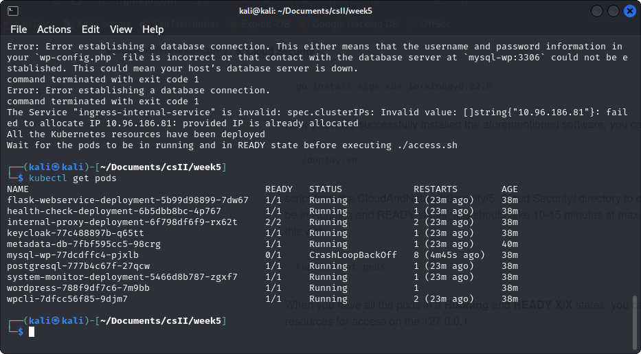

The system can be accessed via URL: `http://localhost:1230/`. Below image shows the successfull access to the URL. 

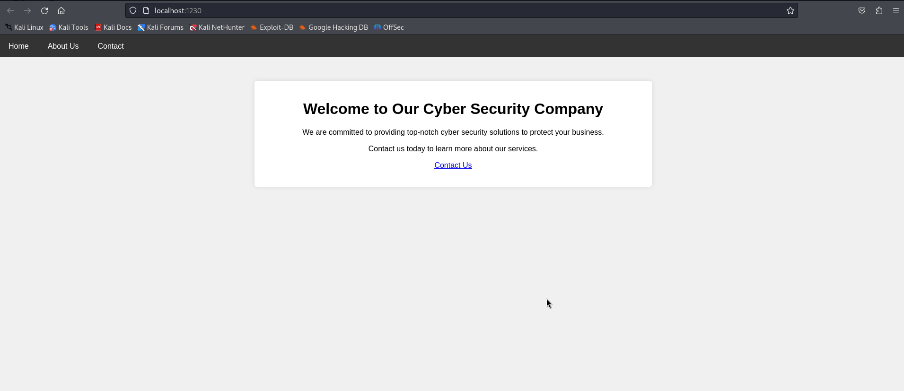

The `keycloak` site can be accessed through the link `keycloak.kyber.local`. The image below shows the login portal to the site. 

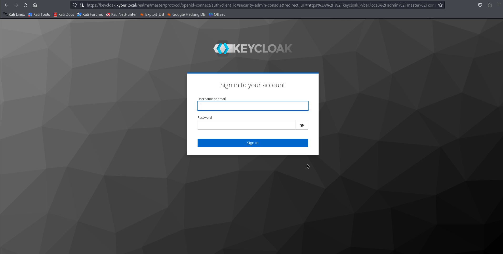

## Finding hidden endpoints

In order to find the vulnerable endpoints, I executed `ffuf` with the given word list. Below is the command to use `ffuf`. 

```terminal
ffuf -w wordlist.txt -u http://localhost:1230/FUZZ
```

The output of above command is as below. 

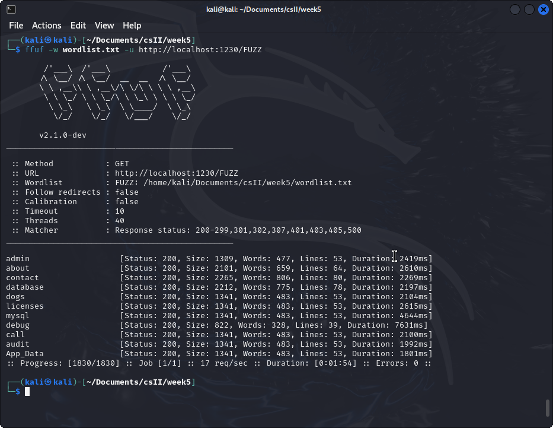

Considering the output,`ffuf` discovered several endpoints on the target application. With the endpoint, `fuff` has given the details on its HTTP status code, size of the response, number of words, number of lines, and the duration it took to receive the response. The discovered endpoints include:
* admin
* about
* contact
* database
* dogs
* licenses
* mysql
* debug
* call
* audit
* App_Data

Endpoints like _admin_, _database_, _mysql_, _debug_, and _App_Data_ could be interesting as they might provide access to sensitive information or administrative functionalities. 

## Getting access to the database

1. As the first step, I tried to access some of the endpoints and it generated the outputs as below. 

    ```cli
    ┌──(kali㉿kali)-[~/Documents/csII/week5]
    └─$ curl -i http://localhost:1230/admin
    HTTP/1.1 200 OK
    Server: Werkzeug/2.2.2 Python/3.9.19
    Date: Fri, 03 May 2024 17:44:17 GMT
    Content-Type: text/html; charset=utf-8
    Content-Length: 1309
    Connection: close
    
    <!DOCTYPE html>
    <html lang="en">
    <head>
        <meta charset="UTF-8">
        <meta name="viewport" content="width=device-width, initial-scale=1.0">
        <title>About Us - Cyber Security Company</title>
        <style>
            body {
                font-family: Arial, sans-serif;
                margin: 0;
                padding: 0;
                background-color: #f0f0f0;
            }
            nav {
                background-color: #333;
                overflow: hidden;
            }
            nav a {
                float: left;
                display: block;
                color: white;
                text-align: center;
                padding: 14px 20px;
                text-decoration: none;
            }
            nav a:hover {
                background-color: #ddd;
                color: black;
            }
            .container {
                max-width: 800px;
                margin: 50px auto;
                padding: 20px;
                background-color: #fff;
                border-radius: 5px;
                box-shadow: 0 0 10px rgba(0, 0, 0, 0.1);
            }
            h1, p {
                text-align: center;
            }
        </style>
    </head>
    <body>
        <nav>
            <a href="/">Home</a>
            <a href="/about">About Us</a>
            <a href="/contact">Contact</a>
        </nav>
        <div class="container">
            <h1>Access to this site is restricted.</h1>
        </div>
    </body>
    </html>
                                                                                                                   
    ┌──(kali㉿kali)-[~/Documents/csII/week5]
    └─$ curl -i http://localhost:1230/debug
    HTTP/1.1 200 OK
    Server: Werkzeug/2.2.2 Python/3.9.19
    Date: Fri, 03 May 2024 17:46:26 GMT
    Content-Type: text/html; charset=utf-8
    Content-Length: 822
    Connection: close
    
    <!DOCTYPE html>
    <html lang="en">
    <head>
        <meta charset="UTF-8">
        <meta name="viewport" content="width=device-width, initial-scale=1.0">
        <title>List of Files</title>
    </head>
    <body>
        <h1>List of Files</h1>
        <ul>
            
                
                    <li><a href="/debug/utils">utils</a></li>
                
            
                
                    <li><a href="/debug/__pycache__">__pycache__</a></li>
                
            
                
                    <li><a href="/debug/Dockerfile">Dockerfile</a></li>
                
            
                
            
                
            
                
                    <li><a href="/debug/requirements.txt">requirements.txt</a></li>
                
            
                
                    <li><a href="/debug/templates">templates</a></li>
                
            
        </ul>
    </body>
    </html>
                                                                                                                  
    ┌──(kali㉿kali)-[~/Documents/csII/week5]
    └─$ curl -i http://localhost:1230/debug/requirements.txt
    HTTP/1.1 200 OK
    Server: Werkzeug/2.2.2 Python/3.9.19
    Date: Fri, 03 May 2024 17:48:39 GMT
    Content-Type: text/html; charset=utf-8
    Content-Length: 315
    Connection: close
    
    <!DOCTYPE html>
    <html lang="en">
    <head>
        <meta charset="UTF-8">
        <meta name="viewport" content="width=device-width, initial-scale=1.0">
        <title>File Content</title>
    </head>
    <body>
        <h1>File Content</h1>
        <pre>Flask==2.2.2
    Werkzeug==2.2.2
    psycopg2-binary==2.9.9
    SQLAlchemy==2.0.0</pre>
    </body>
    </html>
                                                                                                              
    ┌──(kali㉿kali)-[~/Documents/csII/week5]
    └─$ curl -i http://localhost:1230/dogs           
    HTTP/1.1 200 OK
    Server: Werkzeug/2.2.2 Python/3.9.19
    Date: Fri, 03 May 2024 17:49:32 GMT
    Content-Type: text/html; charset=utf-8
    Content-Length: 1341
    Connection: close
    
    <!DOCTYPE html>
    <html lang="en">
    <head>
        <meta charset="UTF-8">
        <meta name="viewport" content="width=device-width, initial-scale=1.0">
        <title>About Us - Cyber Security Company</title>
        <style>
            body {
                font-family: Arial, sans-serif;
                margin: 0;
                padding: 0;
                background-color: #f0f0f0;
            }
            nav {
                background-color: #333;
                overflow: hidden;
            }
            nav a {
                float: left;
                display: block;
                color: white;
                text-align: center;
                padding: 14px 20px;
                text-decoration: none;
            }
            nav a:hover {
                background-color: #ddd;
                color: black;
            }
            .container {
                max-width: 800px;
                margin: 50px auto;
                padding: 20px;
                background-color: #fff;
                border-radius: 5px;
                box-shadow: 0 0 10px rgba(0, 0, 0, 0.1);
            }
            h1, p {
                text-align: center;
            }
        </style>
    </head>
    <body>
        <nav>
            <a href="/">Home</a>
            <a href="/about">About Us</a>
            <a href="/contact">Contact</a>
        </nav>
        <div class="container">
            <h1>This is still work in progress. Please check the site again later.</h1>
        </div>
    </body>
    </html>
                                                                                                                 
    ┌──(kali㉿kali)-[~/Documents/csII/week5]
    └─$ curl -i http://localhost:1230/mysql
    HTTP/1.1 200 OK
    Server: Werkzeug/2.2.2 Python/3.9.19
    Date: Fri, 03 May 2024 17:49:55 GMT
    Content-Type: text/html; charset=utf-8
    Content-Length: 1341
    Connection: close
    
    <!DOCTYPE html>
    <html lang="en">
    <head>
        <meta charset="UTF-8">
        <meta name="viewport" content="width=device-width, initial-scale=1.0">
        <title>About Us - Cyber Security Company</title>
        <style>
            body {
                font-family: Arial, sans-serif;
                margin: 0;
                padding: 0;
                background-color: #f0f0f0;
            }
            nav {
                background-color: #333;
                overflow: hidden;
            }
            nav a {
                float: left;
                display: block;
                color: white;
                text-align: center;
                padding: 14px 20px;
                text-decoration: none;
            }
            nav a:hover {
                background-color: #ddd;
                color: black;
            }
            .container {
                max-width: 800px;
                margin: 50px auto;
                padding: 20px;
                background-color: #fff;
                border-radius: 5px;
                box-shadow: 0 0 10px rgba(0, 0, 0, 0.1);
            }
            h1, p {
                text-align: center;
            }
        </style>
    </head>
    <body>
        <nav>
            <a href="/">Home</a>
            <a href="/about">About Us</a>
            <a href="/contact">Contact</a>
        </nav>
        <div class="container">
            <h1>This is still work in progress. Please check the site again later.</h1>
        </div>
    </body>
    </html>                                                                                                                 
    
    ```

2. The database url appears as below when I access it via web browser. 

    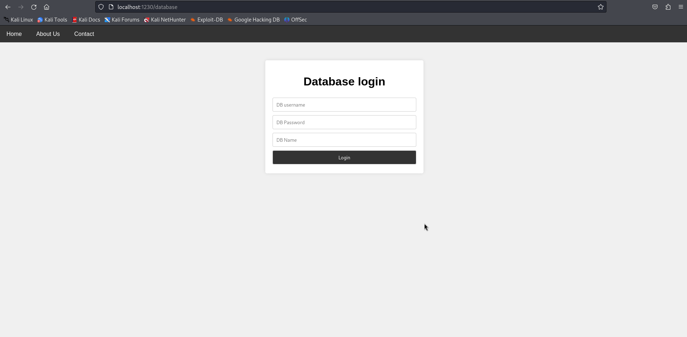

3. Next, I checked for the files of the pod that running the web appliaction. I used the `http://localhost:1230/debug` link. The output is generated as below. 

    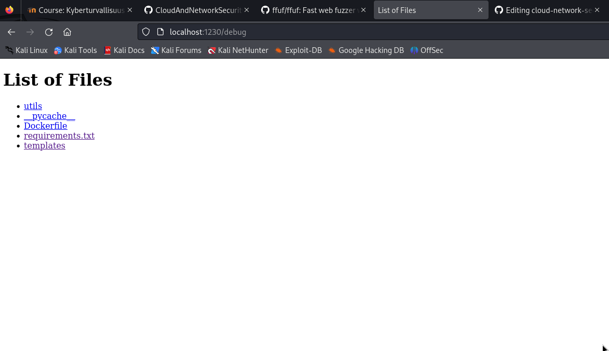

4. The content of the `Dockerfile` is shown in the below image.

   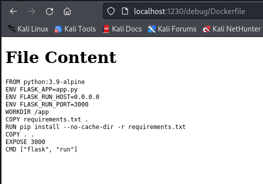

    The content of the `Dockerfile` shows that the environmental variable FLASK_APP is `app.py`. Assuming that it will contain a way to access the `database` I access the file system of the docker container with below commands and check for the `app.py` inside the container.

5. The docker container can be access following below steps.

   ```cli  
    ┌──(kali㉿kali)-[~/Documents/csII/week5]
    └─$ docker ps
    
    CONTAINER ID   IMAGE                  COMMAND                  CREATED       STATUS          PORTS                                                                 NAMES
    52132f08b70a   kindest/node:v1.29.2   "/usr/local/bin/entr…"   4 hours ago   Up 23 minutes   0.0.0.0:80->80/tcp, 0.0.0.0:443->443/tcp, 127.0.0.1:32899->6443/tcp   kind-cloudsec-control-plane
    d05030f9d47e   kindest/node:v1.29.2   "/usr/local/bin/entr…"   6 hours ago   Up 23 minutes   127.0.0.1:34327->6443/tcp                                             kind-control-plane
                                                                                                                                                                                                                                                
    ┌──(kali㉿kali)-[~/Documents/csII/week5]
    └─$ docker exec -it 52132f08b70a sh

    #
   ```

6. Inside the docker shell, I looked for the `app.py`file. The output is as follows.

   ```cli
    ┌──(kali㉿kali)-[~/Documents/csII/week5]
    └─$ docker exec -it 52132f08b70a sh  
    
    # ls
    LICENSES  bin  boot  dev  etc  home  kind  lib  lib64  media  mnt  opt  proc  root  run  sbin  srv  sys  tmp  usr  var
    # find / -name "app.py" 2>/dev/null
    
    /run/containerd/io.containerd.runtime.v2.task/k8s.io/391b91bf638285a0cc19f94134b89401cf528943092441614461ea44a1f38ac3/rootfs/usr/local/lib/python3.9/site-packages/flask/app.py
    /run/containerd/io.containerd.runtime.v2.task/k8s.io/391b91bf638285a0cc19f94134b89401cf528943092441614461ea44a1f38ac3/rootfs/app/app.py
    /run/containerd/io.containerd.runtime.v2.task/k8s.io/0c3bcdeceb454e259aeae083f9dc3d1c4ad4db4be52bbf3f58a15bceb5f85ae9/rootfs/usr/local/lib/python3.12/site-packages/flask/app.py
    /run/containerd/io.containerd.runtime.v2.task/k8s.io/0c3bcdeceb454e259aeae083f9dc3d1c4ad4db4be52bbf3f58a15bceb5f85ae9/rootfs/usr/local/lib/python3.12/site-packages/flask/sansio/app.py
    /run/containerd/io.containerd.runtime.v2.task/k8s.io/0c3bcdeceb454e259aeae083f9dc3d1c4ad4db4be52bbf3f58a15bceb5f85ae9/rootfs/app.py
    /var/lib/containerd/io.containerd.snapshotter.v1.overlayfs/snapshots/240/fs/usr/local/lib/python3.9/site-packages/flask/app.py
    /var/lib/containerd/io.containerd.snapshotter.v1.overlayfs/snapshots/241/fs/app/app.py
    /var/lib/containerd/io.containerd.snapshotter.v1.overlayfs/snapshots/273/fs/usr/lib/mysqlsh/lib/python3.9/site-packages/oci/identity_domains/models/app.py
    /var/lib/containerd/io.containerd.snapshotter.v1.overlayfs/snapshots/297/fs/app.py
    /var/lib/containerd/io.containerd.snapshotter.v1.overlayfs/snapshots/298/fs/usr/local/lib/python3.12/site-packages/flask/app.py
    /var/lib/containerd/io.containerd.snapshotter.v1.overlayfs/snapshots/298/fs/usr/local/lib/python3.12/site-packages/flask/sansio/app.py
    # # cat /var/lib/containerd/io.containerd.snapshotter.v1.overlayfs/snapshots/241/fs/app/app.py
    
    from flask import Flask, render_template, url_for, request, redirect, session, jsonify, Response, make_response, send_from_directory
    import os
    import psycopg2
    from psycopg2 import Error
    from utils.query import fetch_data_from_database
    
    app = Flask(__name__)
    app.secret_key = 'default_secret_key'
    
    @app.before_request
    def before_request():
        if request.path != '/' and request.path.endswith('/'):
            return redirect(request.path[:-1])
    
    @app.route('/debug')
    def list_files():
        files = os.listdir('.')
        return render_template('debug.html', files=files)
    
    @app.route('/debug/<path:filename>')
    def serve_file(filename):
        try:
            with open(filename, 'r') as f:
                file_content = f.read()
            return render_template('file_content.html', file_content=file_content)
        except FileNotFoundError:
            return 'File not found', 404
    
    @app.route('/')
    def index():
        return render_template('index.html')
    
    @app.route('/contact')
    def contact():
        return render_template('contact.html')
    
    @app.route('/about')
    def about():
        return render_template('about.html')
    
    @app.route('/wip')
    def vendor():
        return render_template('wip.html')
    
    @app.route('/dogs')
    def dogs():
        return render_template('wip.html')
    
    @app.route('/licenses')
    def lisences():
        return render_template('wip.html')
    
    @app.route('/mysql')
    def sql():
        return render_template('wip.html')
    
    @app.route('/call')
    def call():
        return render_template('wip.html')
    
    @app.route('/audit')
    def audit():
        return render_template('wip.html')
    
    @app.route('/App_Data')
    def app_data():
        return render_template('wip.html')
    
    @app.route('/admin')
    def admin():
        return render_template('restricted.html')
    
    @app.route('/database', methods=['GET', 'POST'])
    def database():
        if request.method == 'POST':
            username = request.form['username']
            password = request.form['password']
            db_name = request.form['database']
            # change this to query from DB service
            if username == 'ouspg_cloud' and password == 'ouspg_cloud_password' and db_name == 'cloud_database':
                data = fetch_data_from_database(db_name, username, 5432, password)
                return render_template('show_database.html', data=data)
            else:
                return render_template('database.html', error='Invalid credentials')
        else:
            return render_template('database.html')
    
    
    if __name__ == '__main__':
        app.run(debug=True, host='0.0.0.0', port=3000)
    # 

   ```

   There are credentials in the python script.
   ```cli
       Username: ouspg_cloud
       Password: ouspg_cloud_password
       db_name: cloud_database
   ```

8. Then I used the credentials to log in to the database. The flag was found in an instanse. 

   Flag is `FLAG{DATABASEACCESSED}`

   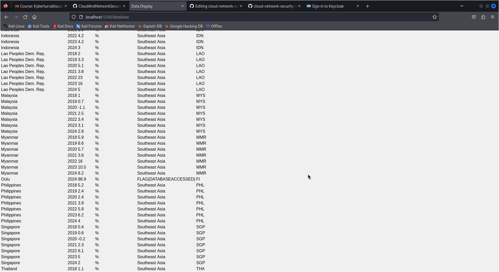

## Accessing the database with superuser credentials from remote

with thelp of `kubectl` the database can be accessed from remote. Below command gives you the service details of the db servise. 

```cli
┌──(kali㉿kali)-[~/Documents/csII/week5]
└─$ kubectl get service

NAME                              TYPE           CLUSTER-IP      EXTERNAL-IP   PORT(S)          AGE
flask-webservice-service          ClusterIP      10.96.126.158   <none>        3000/TCP         21h
health-check-service              ClusterIP      10.96.142.26    <none>        80/TCP           21h
internal-proxy-api-service        ClusterIP      10.96.86.91     <none>        3000/TCP         21h
internal-proxy-info-app-service   NodePort       10.96.197.197   <none>        5000:30003/TCP   21h
keycloak                          ClusterIP      10.96.206.37    <none>        8080/TCP         21h
kubernetes                        ClusterIP      10.96.0.1       <none>        443/TCP          21h
metadata-db                       ClusterIP      10.96.17.154    <none>        80/TCP           21h
mysql-wp                          ClusterIP      10.96.85.41     <none>        3306/TCP         21h
postgresql-service                LoadBalancer   10.96.89.111    <pending>     5432:31366/TCP   21h
system-monitor-service            ClusterIP      10.96.29.152    <none>        8080/TCP         21h
wordpress                         LoadBalancer   10.96.97.133    <pending>     80:30940/TCP     21h
                                                                                                                                                           
┌──(kali㉿kali)-[~/Documents/csII/week5]
└─$ kubectl describe pod postgresql-777b4c67f-lqj8v
Name:             postgresql-777b4c67f-lqj8v
Namespace:        default
Priority:         0
Service Account:  default
Node:             kind-cloudsec-control-plane/172.18.0.2
Start Time:       Fri, 03 May 2024 11:28:42 -0400
Labels:           app=postgresql
                  pod-template-hash=777b4c67f
Annotations:      <none>
Status:           Running
IP:               10.244.0.8
IPs:
  IP:           10.244.0.8
Controlled By:  ReplicaSet/postgresql-777b4c67f
Containers:
  postgresql:
    Container ID:   containerd://d7ef2ba7212ddcd01b10e7c5ca315d72dd2a43e8f0a99d68108f1a370b4b4769
    Image:          suturri/database:latest
    Image ID:       docker.io/suturri/database@sha256:bdcac6c72c25c605055b93d54dcde74586153d5bf83c4fa3dd65079a08b572b5
    Port:           5432/TCP
    Host Port:      0/TCP
    State:          Running
      Started:      Sat, 04 May 2024 04:56:46 -0400
    Last State:     Terminated
      Reason:       Unknown
      Exit Code:    255
      Started:      Fri, 03 May 2024 14:54:30 -0400
      Finished:     Sat, 04 May 2024 04:56:16 -0400
    Ready:          True
    Restart Count:  2
    Environment:    <none>
    Mounts:
      /var/lib/postgresql/data from postgresql-storage (rw)
      /var/run/secrets/kubernetes.io/serviceaccount from kube-api-access-ltxsk (ro)
Conditions:
  Type                        Status
  PodReadyToStartContainers   True 
  Initialized                 True 
  Ready                       True 
  ContainersReady             True 
  PodScheduled                True 
Volumes:
  postgresql-storage:
    Type:       EmptyDir (a temporary directory that shares a pod's lifetime)
    Medium:     
    SizeLimit:  <unset>
  kube-api-access-ltxsk:
    Type:                    Projected (a volume that contains injected data from multiple sources)
    TokenExpirationSeconds:  3607
    ConfigMapName:           kube-root-ca.crt
    ConfigMapOptional:       <nil>
    DownwardAPI:             true
QoS Class:                   BestEffort
Node-Selectors:              <none>
Tolerations:                 node.kubernetes.io/not-ready:NoExecute op=Exists for 300s
                             node.kubernetes.io/unreachable:NoExecute op=Exists for 300s
Events:                      <none>

```

From the description, we can observe that the DB service can be accessed by the IP `172.18.0.2`. The username, database name and the password are already known. Therefore, we can access the database using below command and it gives access to the database in terminal. 

```cli                                                                                                                                                           
┌──(kali㉿kali)-[~/Documents/csII/week5]
└─$ psql -h 172.18.0.2 -p 31366 -U ouspg_cloud -d cloud_database

Password for user ouspg_cloud: 
psql (16.2 (Debian 16.2-1))
Type "help" for help.

cloud_database=# 
cloud_database=# 
```

The flag can be found as below. Flag is: `FLAG{ACCESSEDTHEDBFROMREMOTE}`

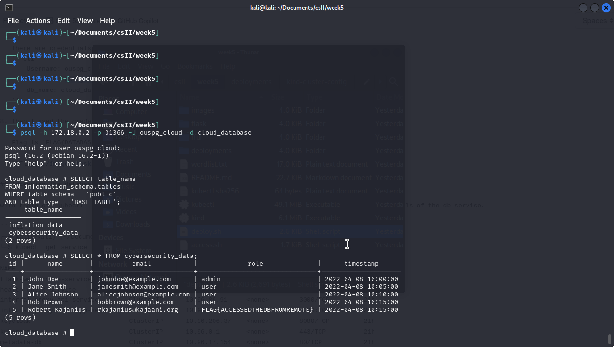

# Task 3
## A)

After I accessed to the URL `http://127.0.0.1:1232/` the details can be obtained using the proxy.

1. GET http://127.0.0.1:5000

    

2. GET http://metadata-db/

   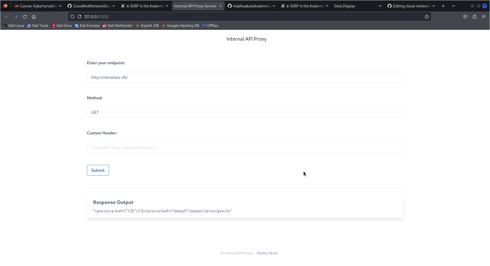

3. GET http://metadata-db/latest/secrets/kubernetes-goat

   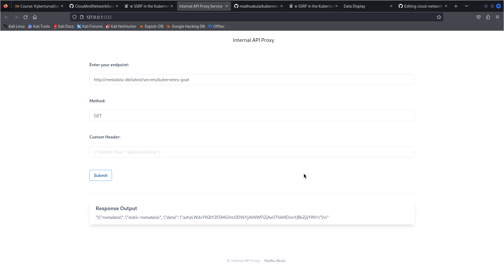

The encrypted flag is: `azhzLWdvYXQtY2E5MGVmODVkYjdhNWFlZjAxOThkMDJmYjBkZjljYWI=`. 

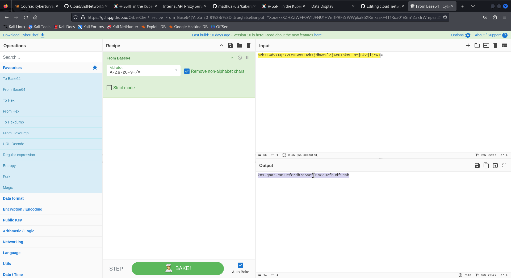

The decoded flag is: `k8s-goat-ca90ef85db7a5aef0198d02fb0df9cab`.

The task shows how attackers can take advantage of built-in Kubernetes functionality, like service DNS queries and discovery, to propagate SSRF vulnerabilities and obtain access to internal microservices in the cluster. Within the Kubernetes cluster, internal-only accessible services like the metadata service can be accessed using SSRF vulnerabilities. Attackers may be able to obtain private data from these services and jeopardize the security of the cluster by doing so. Attackers can use base64 decoding techniques to unlock secret information if they have access to sensitive data, such as flags placed in metadata endpoints.

## B)

1. Below image shows how the docker CIS benchmark is initiated and how the shell of the `docker-bench-security-7h426` pod is accessed. 

    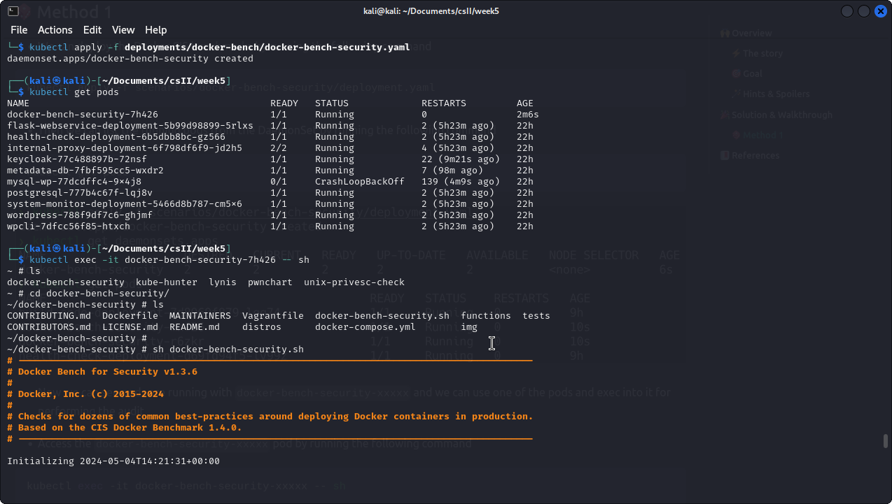

2. Below image shows the results of the CIS benchmark audit results.

    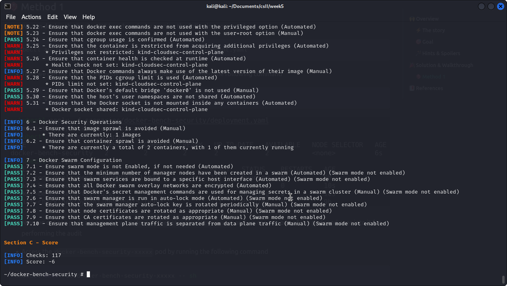

Organizations can guarantee uniform security procedures throughout their Docker environments by adhering to the defined security baseline provided by Docker CIS benchmarks. Organizations can create a standard approach for assessing and enhancing container security by following these criteria. By performing automated audits against a predetermined set of security tests, Docker CIS benchmarks are helpful. These inspections include host security settings, runtime parameters, and container images, among other aspects of container security. Organizations can reduce security risks and improve the overall state of their security by addressing the security concerns found by the Docker CIS benchmarks. By taking a proactive approach, insecure Docker setups can be avoided, potentially preventing security breaches and data leaks.

# Task 4

I have some issues with the wp database. 

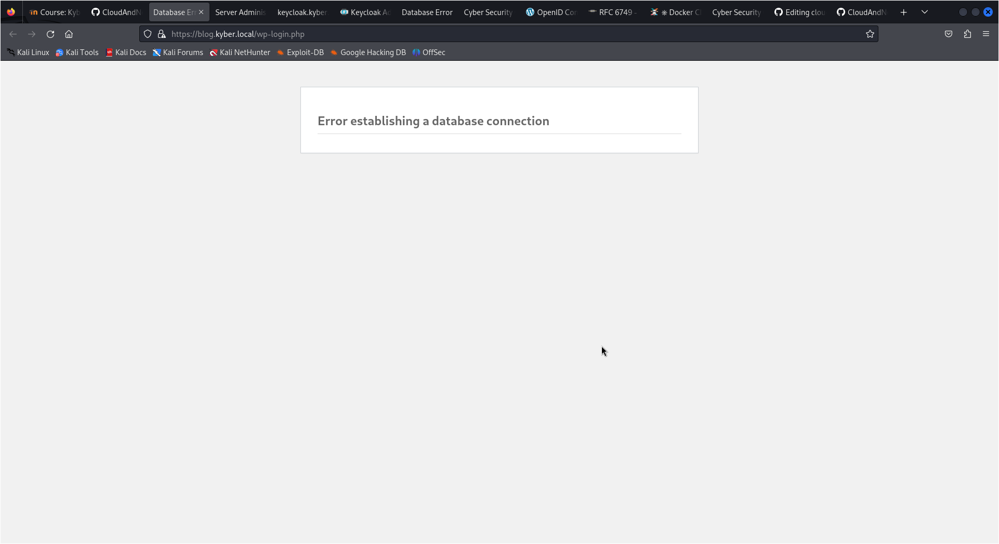
