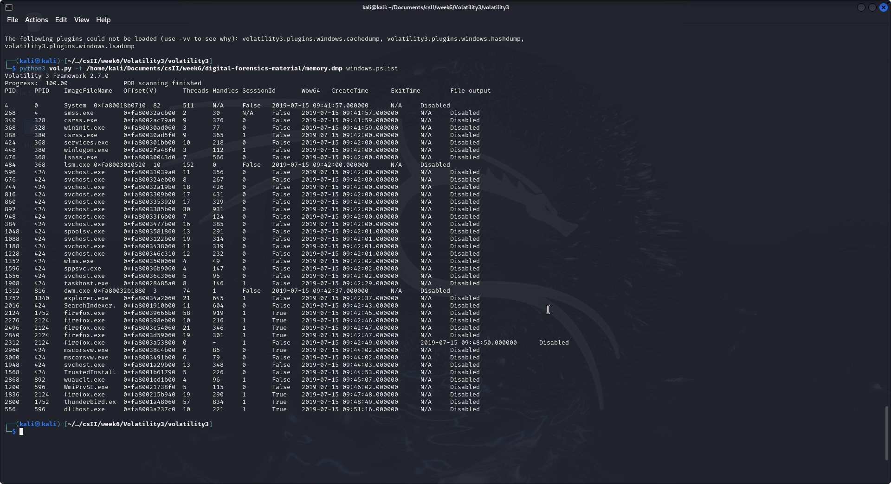
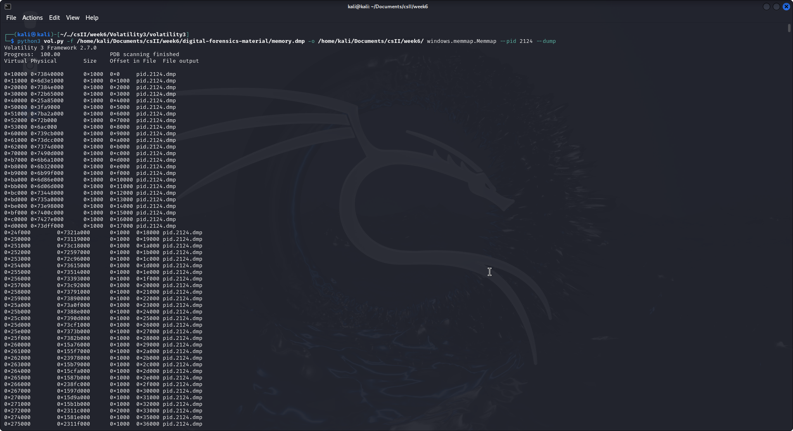
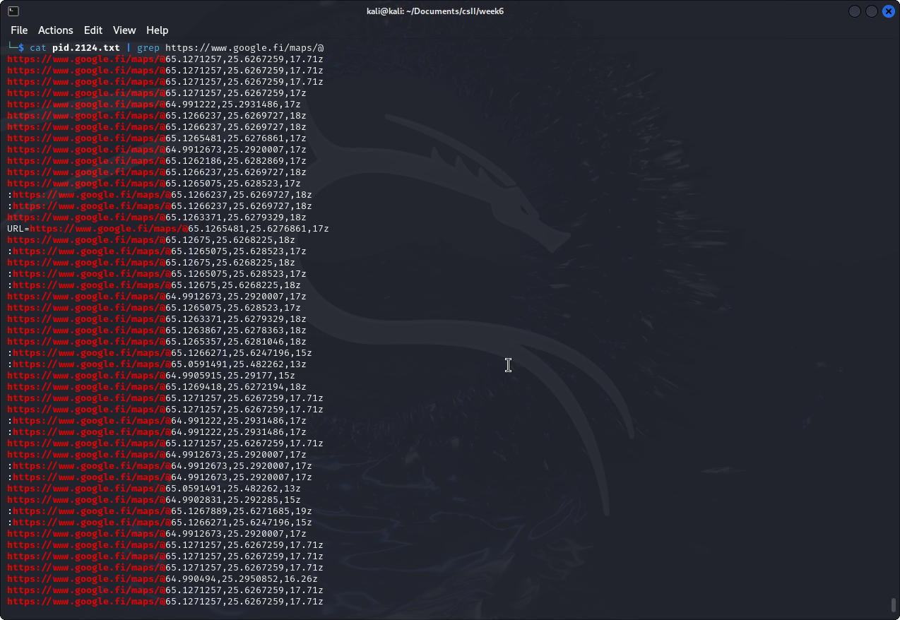
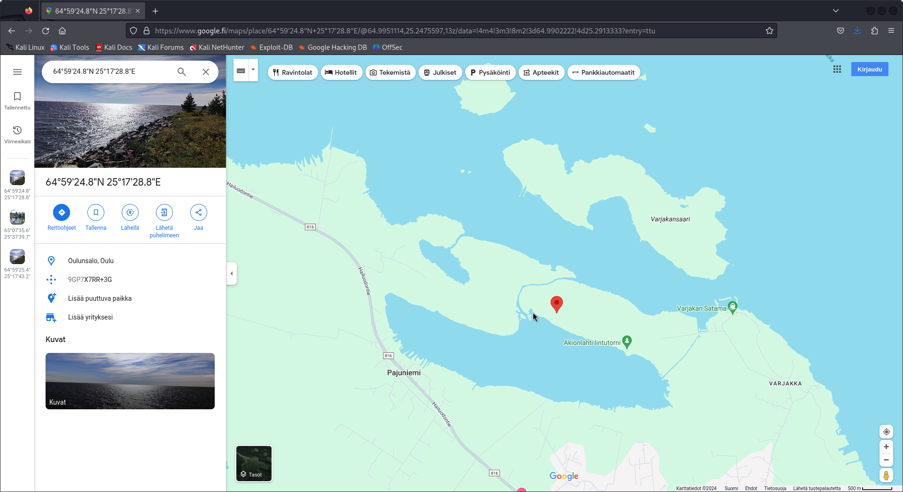
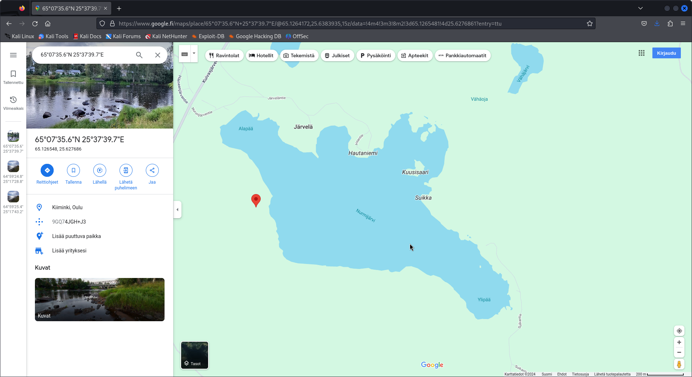
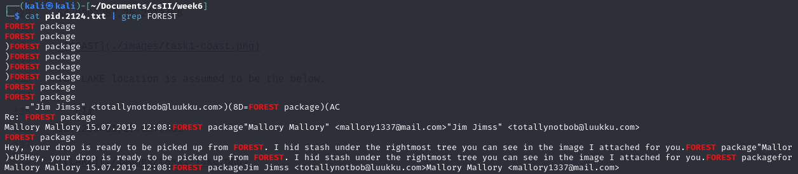
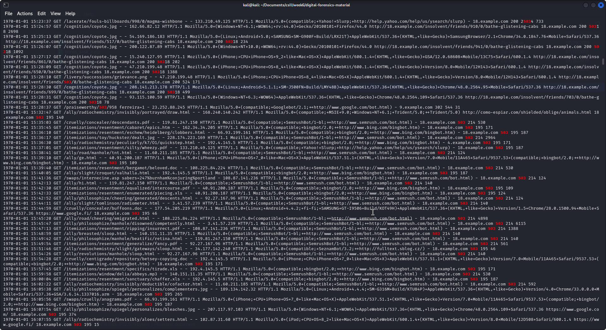

# Task 1

To analyze the memory file, I started with cloning the `Volatility 3` git repo. After cloning and directing into the `volatility 3` directory, I used this command to check for available options of the tool `python3 vol.py -h`. The commands related to the Windows are as below. I assumed Mallory's PC as Windows. 

```cli
    windows.callbacks.Callbacks
                        Lists kernel callbacks and notification routines.
    windows.cmdline.CmdLine
                        Lists process command line arguments.
    windows.crashinfo.Crashinfo
                        Lists the information from a Windows crash dump.
    windows.devicetree.DeviceTree
                        Listing tree based on drivers and attached devices in a particular windows memory image.
    windows.dlllist.DllList
                        Lists the loaded modules in a particular windows memory image.
    windows.driverirp.DriverIrp
                        List IRPs for drivers in a particular windows memory image.
    windows.drivermodule.DriverModule
                        Determines if any loaded drivers were hidden by a rootkit
    windows.driverscan.DriverScan
                        Scans for drivers present in a particular windows memory image.
    windows.dumpfiles.DumpFiles
                        Dumps cached file contents from Windows memory samples.
    windows.envars.Envars
                        Display process environment variables
    windows.filescan.FileScan
                        Scans for file objects present in a particular windows memory image.
    windows.getservicesids.GetServiceSIDs
                        Lists process token sids.
    windows.getsids.GetSIDs
                        Print the SIDs owning each process
    windows.handles.Handles
                        Lists process open handles.
    windows.iat.IAT     Extract Import Address Table to list API (functions) used by a program contained in external libraries
    windows.info.Info   Show OS & kernel details of the memory sample being analyzed.
    windows.joblinks.JobLinks
                        Print process job link information
    windows.ldrmodules.LdrModules
                        Lists the loaded modules in a particular windows memory image.
    windows.malfind.Malfind
                        Lists process memory ranges that potentially contain injected code.
    windows.mbrscan.MBRScan
                        Scans for and parses potential Master Boot Records (MBRs)
    windows.memmap.Memmap
                        Prints the memory map
    windows.mftscan.ADS
                        Scans for Alternate Data Stream
    windows.mftscan.MFTScan
                        Scans for MFT FILE objects present in a particular windows memory image.
    windows.modscan.ModScan
                        Scans for modules present in a particular windows memory image.
    windows.modules.Modules
                        Lists the loaded kernel modules.
    windows.mutantscan.MutantScan
                        Scans for mutexes present in a particular windows memory image.
    windows.netscan.NetScan
                        Scans for network objects present in a particular windows memory image.
    windows.netstat.NetStat
                        Traverses network tracking structures present in a particular windows memory image.
    windows.poolscanner.PoolScanner
                        A generic pool scanner plugin.
    windows.privileges.Privs
                        Lists process token privileges
    windows.pslist.PsList
                        Lists the processes present in a particular windows memory image.
    windows.psscan.PsScan
                        Scans for processes present in a particular windows memory image.
    windows.pstree.PsTree
                        Plugin for listing processes in a tree based on their parent process ID.
    windows.registry.certificates.Certificates
                        Lists the certificates in the registry's Certificate Store.
    windows.registry.hivelist.HiveList
                        Lists the registry hives present in a particular memory image.
    windows.registry.hivescan.HiveScan
                        Scans for registry hives present in a particular windows memory image.
    windows.registry.printkey.PrintKey
                        Lists the registry keys under a hive or specific key value.
    windows.registry.userassist.UserAssist
                        Print userassist registry keys and information.
    windows.sessions.Sessions
                        lists Processes with Session information extracted from Environmental Variables
    windows.skeleton_key_check.Skeleton_Key_Check
                        Looks for signs of Skeleton Key malware
    windows.ssdt.SSDT   Lists the system call table.
    windows.statistics.Statistics
                        Lists statistics about the memory space.
    windows.strings.Strings
                        Reads output from the strings command and indicates which process(es) each string belongs to.
    windows.svcscan.SvcScan
                        Scans for windows services.
    windows.symlinkscan.SymlinkScan
                        Scans for links present in a particular windows memory image.
    windows.thrdscan.ThrdScan
                        Scans for windows threads.
    windows.truecrypt.Passphrase
                        TrueCrypt Cached Passphrase Finder
    windows.vadinfo.VadInfo
                        Lists process memory ranges.
    windows.vadwalk.VadWalk
                        Walk the VAD tree.
    windows.vadyarascan.VadYaraScan
                        Scans all the Virtual Address Descriptor memory maps using yara.
    windows.verinfo.VerInfo
                        Lists version information from PE files.
    windows.virtmap.VirtMap
                        Lists virtual mapped sections.
    yarascan.YaraScan   Scans kernel memory using yara rules (string or file).

```

As the first step, I started with listing the processes captured in the memory dump. Fortunately, the Windows command worked. The list was given as below. 



For the next task, the memory dump was analyzed using the command `windows.memmap.Memmap` which prints the memory map of the any process we find in above list. For this task, I mainly focus on any traces related to web browsers. The process with most number of threads is chosen for the analysis which is the process with ID `2124`. The command generate the memory map is: 

```cli
python3 vol.py -f /home/kali/Documents/csII/week6/digital-forensics-material/memory.dmp -o /home/kali/Documents/csII/week6/ windows.memmap.Memmap --pid 2124 --dump
```


A file names `pid.2124.dmp` is created after the command runs. To analyze the file, I converted it into a text file using `strings pid.2124.dmp > pid.2124.txt`. Since I am lokking for GPS details in the `Google` search engine, the keyword I looked for are `map` and `www.google.com`. A clear output was generated with the command `cat pid.2124.txt | grep https://www.google.fi/maps/@`.



There are some GPS locations visible. According to the code they are using the location COAST should be the GPS coordinates below. 

```cli
64.9902287,25.2913408
```


The LAKE location is assumed to be the below. 

```cli
65.1265481,25.6276861
```


In order to find if there are any email conversations captured in the memory dump, I scanned the generated text file for the keyword `FOREST`. The result shows that there is an email conversation between Mallory and a person called Jim. The conversation is as follows. 



The content of the message includes the locations of the hidden stash. 

# Task 2

 When the DDoS attack takes place the server response with status `503 Service Unavailable`. Therefore, I scanned the log file to search for `503`.

 ```cli
grep "503" anonlog
```

The command generated many responses with the 503 responses. The time that the `503` response had started is `15:32:47` which means statring from that time, the website `18.example.com` was not responding.



Next, I checked for the details before the attacked begin which is before `15:32:47`. Below image shows the logs after the server was down. 


Since there are many logs with the request `GET /haku searchstring=*`, I assume that the attacker mush have chosen the same request before to launch the attack. It appeared the HTTP requests for `/haku` page was normal just before the attack began. 


# Task 3


