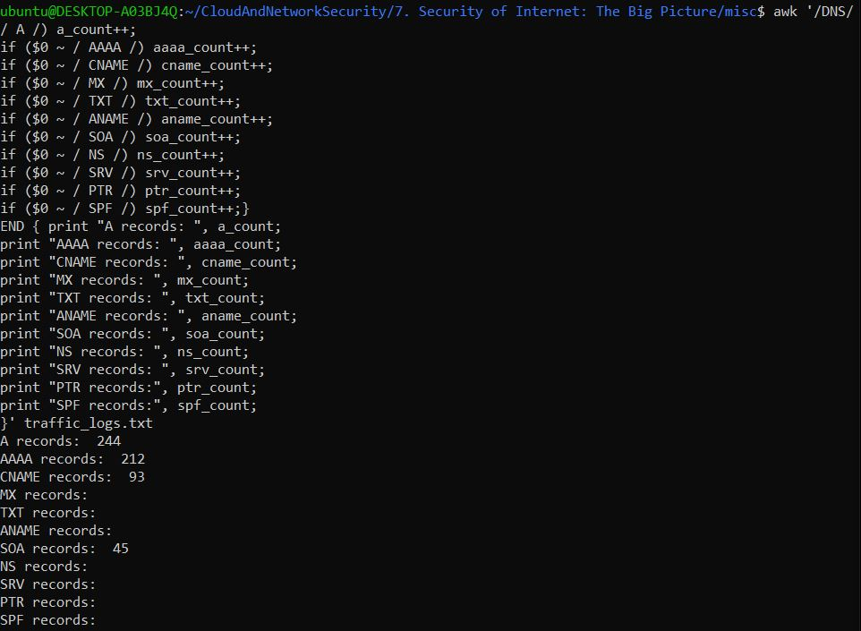
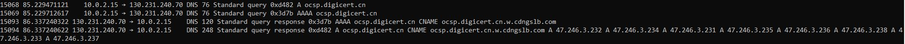

# Task 1

## A)

According to Google, there are approximately 90 DNS record types available A few of the common DNS record types are shown below. 

**1. A Record (address)‍** - 
It serves as a translator by translating domain names into IP addresses and is most frequently used to map a fully qualified domain name (FQDN) to an IPv4 address.

**2. AAAA Record (quad A)** - 
Comparable to A Records, but this is mapping to an IPv6 address (if accessible, IPv6 is preferred by smartphones).

**3. CNAME Record (Canonical Name)** - 
An alias that, never an IP address, refers to a different domain or subdomain. Alias records that map several hosts to a single location and FQDN to FQDN. Additionally useful is this record, which lets you modify IP addresses over time without disrupting user bookmarks or other data.

**4. ANAME Record** - 
You can use this record type to point your domain's root to a hostname or FQDN.

**5. SOA Record (Start of Authority)‍** - 
This is used to control the propagation of a DNS zone to secondary name servers and stores domain information.

**6. NS Record (name server)‍** - 
Name servers that are authoritative for a domain or subdomains are specified (a CNAME should not be used for these entries).

**7. MX Record (Mail eXchange)‍** - 
This uses mail servers to map a domain's email delivery locations; the mail server name, not the IP address, should be pointed to.

**8. TXT (text) Record‍** - 
It doesn't require any particular formatting and can be used for things like email validation, site and ownership verification, framework regulations, etc. It also lets administrators add limited human and machine-readable remarks.

**9. SRV Record (service)‍** - 
Enables the routing of services to a different host and port location, such as VoIP and instant messaging.

**10. PTR Record (pointer)** - 
A reverse mapping of IP addresses to domain names, similar to A and AAAA records. These entries must be placed in reverse zones and cannot exist in the same zone as other DNS record types. They also require domain authority.

**11. SPF Record (sender policy framework)‍** - 
Prevents spammers and aids in the prevention of email spoofing.
Note: Not all providers may still provide this record type, which has been deprecated in favor of TXT record formats. As long as new settings are in TXT record format, we will continue to allow adding, removing, and changing SPF records that are currently in your Constellix account.

Below I have mentioned 5 of the malicious activities of the DNS traffic with the related the DNS record type. 

**1. Malware Installation:** - 
Indicators in this attack is modifications in the host's files and DNS cache poisoning. The attack looks for forward DNS lookups of typo-squatting domains or unusual changes in A and AAAA records.

**2. Credential Theft:** - 
The indicator is similar to those for malware installation, including DNS cache poisoning. The attack forwards DNS lookups of domains similar to legitimate ones (typo-squatting).

**3. Command & Control (C2) Communication:** -
This attack is indicated with low time-to-live values and orphan DNS requests (queries with no responses or vice versa). In this case, DNS beaconing queries to anomalous or suspicious domains.

**4. Network Footprinting:** - 
The indicator is numerous forward DNS lookups for non-existent subdomains within a root domain. A large number of PTR queries, SOA, and AXFER queries are generated in the attack. 

**5. Data Theft:** - 
A large number of subdomain lookups or unusually large lookup sizes are made in this attack. The indicators are long subdomains, uncommon query types such as excessive TXT records. 


**References:**
* https://bluecatnetworks.com/blog/know-the-eight-most-common-dns-records/#:~:text=DNS%20(which%20stands%20for%20domain,different%20official%20resource%20record%20types.
* https://constellix.com/news/dns-record-types-cheat-sheet

The DNS record types of the `traffic_logs.txt` can be analyzed using the below command. First, the log entries of `DNS` are filtered using `awk` and then I checked for each record type individually to check whether there are DNS entries. Next the command was extended to count entries under each record type. The final command is as follows. 

```cli
awk '/DNS/ { if ($0 ~ / A /) a_count++; 
if ($0 ~ / AAAA /) aaaa_count++; 
if ($0 ~ / CNAME /) cname_count++; 
if ($0 ~ / MX /) mx_count++; 
if ($0 ~ / TXT /) txt_count++; 
if ($0 ~ / ANAME /) aname_count++; 
if ($0 ~ / SOA /) soa_count++; 
if ($0 ~ / NS /) ns_count++;
if ($0 ~ / SRV /) srv_count++;
if ($0 ~ / PTR /) ptr_count++;
if ($0 ~ / SPF /) spf_count++;} 
END { print "A records: ", a_count; 
print "AAAA records: ", aaaa_count; 
print "CNAME records: ", cname_count; 
print "MX records: ", mx_count; 
print "TXT records: ", txt_count;
print "ANAME records: ", aname_count;
print "SOA records: ", soa_count;
print "NS records: ", ns_count;
print "SRV records: ", srv_count;
print "PTR records:", ptr_count;
print "SPF records:", spf_count;
}' traffic_logs.txt
```

As per the output of this command, the included record types are `A`, `AAAA`, `CNAME` and `SOA`. 



To find the host machine IP, the below command was executed. 

```cli
awk '/DNS/ && /Standard query / {print $3}' traffic_logs.txt | sort | uniq -c
```

The command produces the output with the below IPs. 

```cli
    228 10.0.2.15
    228 130.231.240.70
```

The host can be identified with the `Standard query` request. 



Host IP: `10.0.2.15`

Sample entry:

```cli
14995 82.494806218 130.231.240.70 → 10.0.2.15    DNS 261 Standard query response 0x2c57 A ocsp.trust-provider.cn CNAME ocsp.trust-provider.cn.c.vedcdnlb.com CNAME dl.steam.clngaa.com.p.ngaagslb.net A 112.50.95.96 A 183.201.243.154 A 36.248.38.100 A 150.139.142.18 A 117.27.246.96
```

Let's analyze the following DNS entry in detail.:


- `14995`: The packet number in the capture file.
- `82.494806218`: The timestamp when the packet was captured, in seconds since the beginning of the capture.
- `130.231.240.70 → 10.0.2.15`: This indicates that the packet is a DNS response from the DNS server at `130.231.240.70` to the client at `10.0.2.15`.
- `DNS 261`: This is a DNS protocol packet with a length of 261 bytes.
- `Standard query response 0x2c57 A`: The DNS response has an ID of `0x2c57`, and it is responding to an `A` (Address) record query.
- `ocsp.trust-provider.cn`: The domain name for which the DNS query was made.
- `CNAME ocsp.trust-provider.cn.c.vedcdnlb.com`: A Canonical Name (CNAME) record, indicating that `ocsp.trust-provider.cn` is an alias for `ocsp.trust-provider.cn.c.vedcdnlb.com`.
- `A 117.27.246.96`: An Address (A) record, providing an IPv4 address for `dl.steam.clngaa.com.p.ngaagslb.net`.
- `A 112.50.95.96`: Another A record, providing a different IPv4 address for the same domain.
- `A 183.201.243.154`: Another A record, providing another IPv4 address for the same domain.
- `A 36.248.38.100`: Another A record, providing another IPv4 address for the same domain.
- `A 150.139.142.18`: Another A record, providing another IPv4 address for the same domain.

## B)

**DNS cache**

A DNS cache is a temporary storage of information about previous DNS lookups on a web browser or OS. The cached information includes IP addresses to domain names mappings. 

DNS caching helps  improve load times, reduce latency, for frequently visited websites, and decrease the load on DNS servers.

# Task 3

## A)

The Internet is a collection of multiple networks. On the other hand, autonomous systems (AS) are also a group of networks but with a unified routing policy. An AS controls a set of IPs that is configured to each AS. Each AS is operated by a large organization, for example, a government agency, a university, an enterprise tech company, or the most common one, internet service providers. [1]

Internet Service Provider (ISP) provides access to the Internet through multiple access mediums such as cable, wireless, fiber-optic connections, DSL, or dial-up. [2] Every ISP operates as an AS because they need to manage their own routing policies and traffic within their network and to/from other networks. While an ISP must function as an AS, an AS does not have to be an ISP. For example, a large corporation might operate its own AS to manage its internal and external network traffic without providing internet services to the public. An ISP can operate multiple ASes. This allows the ISP to implement different routing policies for different segments of their network also greater control and flexibility in optimizing network performance, managing traffic congestion, ensuring reliability, and maintaining redundancy. Since the AS has a unified routing policy, by having multiple ASes, ISPs can better manage and optimize traffic flow across their network, balancing loads, avoiding congestion, and ensuring faster and more reliable data delivery. [3]

The network isolation splits a network into discrete segments, or subnets, each of which operates as a separate, independent network. In a wider network topology, this tactic improves security and performance by containing possible attacks and minimizing traffic congestion. [4]

A portion of the internet accessible solely through software clients is known as the "dark web." It is most notoriously recognized for occasionally enabling criminal conduct. But there are also useful applications for it, and specialists in the field might gain from familiarizing themselves with the important data that might be concealed there.
Users can access information, websites, and marketplaces in a private, encrypted manner thanks to the dark web. Search engines are unable to locate it, and accessing it necessitates installing particular software. Peer-to-peer sharing enables anonymity and decentralization for both users and creators. [5]

For autonomous systems (ASs) on the internet to exchange routing information, routing protocols are necessary. The Border Gateway Protocol (BGP) is the main protocol used for this purpose. 

By identifying the optimal routes for data packets, BGP is the protocol that ASs use to share routing information, enabling data transit over the internet.
Since BGP is a path vector protocol, it keeps track of the path data that is dynamically updated when the topology of the network shifts. To share routing data, BGP routers in various ASs connect to one another and create a BGP session. These sessions can occur between peers in separate ASs (external BGP, or eBGP) or between peers in the same AS (internal BGP, or iBGP). Routes are publicized by BGP routers to their peers. These adverts provide the AS path (a list of ASs the route has passed through) and the IP prefixes that can be reached via the AS. BGP chooses the optimal route to a destination based on a number of factors. The AS path length, next-hop IP address, local preference, and MED (multi-exit discriminator) are some of these features.  Network administrators have the ability to set up BGP to apply routing policies according to the requirements of their company, which might impact advertisement and route selection. [6]

Below are the details of my current IP which is being searched in bgp.tool. 


**References:**

1. https://www.cloudflare.com/learning/network-layer/what-is-an-autonomous-system/#:~:text=An%20autonomous%20system%20(AS)%20is,number%20that%20identifies%20the%20AS.
2. https://www.verizon.com/about/blog/isp-meaning
3. https://www.cachefly.com/news/discover-how-autonomous-systems-isps-and-asns-drive-digital-highways/
4. https://nilesecure.com/network-security/network-isolation-what-it-is-how-it-works-for-security/
5. https://www.authentic8.com/blog/understanding-dark-web-and-how-it-can-aid-your-investigation
6. https://community.fs.com/encyclopedia/bgp.html 

## B)

In order to determine the number of ASs in Finland, I used the website called [funet.fi.](https://lg.funet.fi/grafana/d/oZF3qbCGz/funet-status?orgId=1) The below image shows details information about ASes in Finland. Currently, there are 81 active AS networks and 1 down. 


According to the [ipinfo.io](https://ipinfo.io/countries/fi#section-asns) _Elisa Oy_ owns the highest number of IPs in Finland with 3 829 760 IPs. The next ISP in line is _Telia Finland Oy_ with 3 682 560 IPs. _CSC_ owns the highest number of IPs in _education_ category. The below image shows more details on the IP count. 


According to the [internetexchangemap.com](https://www.internetexchangemap.com/#/country/finland) Finland has 13 IXPs. The image shows a map of IXPs in Finland. 


Finland's and the Nordic region's internet infrastructure is distinguished by its dispersed architecture. Numerous significant ISPs, including DNA, Elisa, and Telia, support Finland's network, guaranteeing reliable connectivity and redundancy. Throughout these networks, Autonomous Systems (ASs) are essential for controlling routing regulations.
Decentralization is emphasized in the Finnish internet infrastructure, where each AS handles its routing to increase overall resilience. To guarantee dependable and secure internet services, national telecom authorities and internet registries such as Traficom keep an eye on and regulate these networks.

**References:**

1. https://en.wikipedia.org/wiki/


## C)

## D)

Routing decisions cannot be made solely based on IP addresses. IP addresses are used to identify endpoints in a network, but other criteria including traffic patterns, network topology, and routing policies all play a role in routing decisions.  Routers keep routing tables with details on the most efficient routes to different network locations. Routing protocols are utilized to update these tables. Routers may share information about network topology and rules through protocols like BGP, OSPF, and EIGRP, which enables them to make more educated judgments than just IP addresses. [1]

Optimizing network performance and dependability requires careful consideration of routing techniques and protocols. They identify the most effective data transmission routes and adjust to shifting traffic patterns and network topologies. BGP is used on the internet for routing autonomous systems. It aids in making sure data travels the most efficient route feasible over various linked and diversified networks.[2] OSPF is an internal gateway protocol based on the link-state routing methodology. It ensures prompt network change adaption by effectively updating routes inside an autonomous system.[3] EIGRP optimizes a network's performance by using measurements like dependability, latency, and bandwidth to guide routing decisions. [4]

A number of risks could materialize if an attacker manages to access a DNS server, seriously jeopardizing user confidence and network security.
DNS spoofing, often known as poisoning, is the practice of attackers changing DNS records to lead visitors to malicious websites, which makes phishing and data theft easier.
In Denial of Service (DoS) attackers can prevent services from being available by making them unreachable by altering DNS entries.
Man-in-the-Middle (MitM) Attacks are generated by having control over DNS, attackers can intercept and modify user communications with reputable websites, potentially resulting in data breaches. [5]


**References:**
1. https://www.globalknowledge.com/us-en/resources/resource-library/articles/routing-protocols-overview/
2. https://datatracker.ietf.org/doc/html/rfc4271
3. https://www.cisco.com/c/en/us/products/ios-nx-os-software/open-shortest-path-first-ospf/index.html
4. https://www.cisco.com/c/en/us/support/docs/ip/enhanced-interior-gateway-routing-protocol-eigrp/13669-1.html
5. https://www.cloudflare.com/learning/dns/dns-security/#:~:text=Does%20Cloudflare%20offer%20DNS%20security,DNS%20functionality%2C%20and%20load%20balancing.
